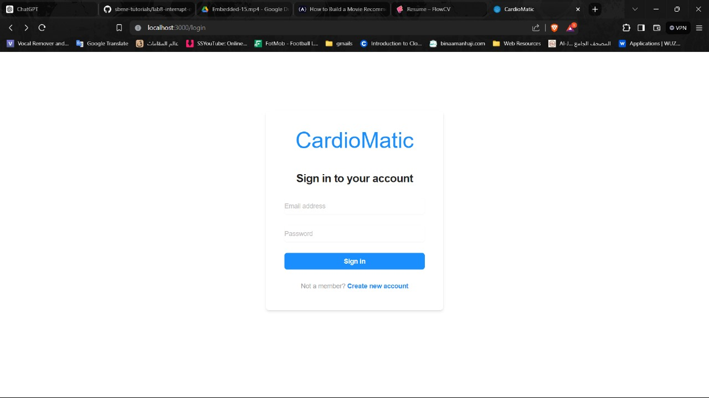
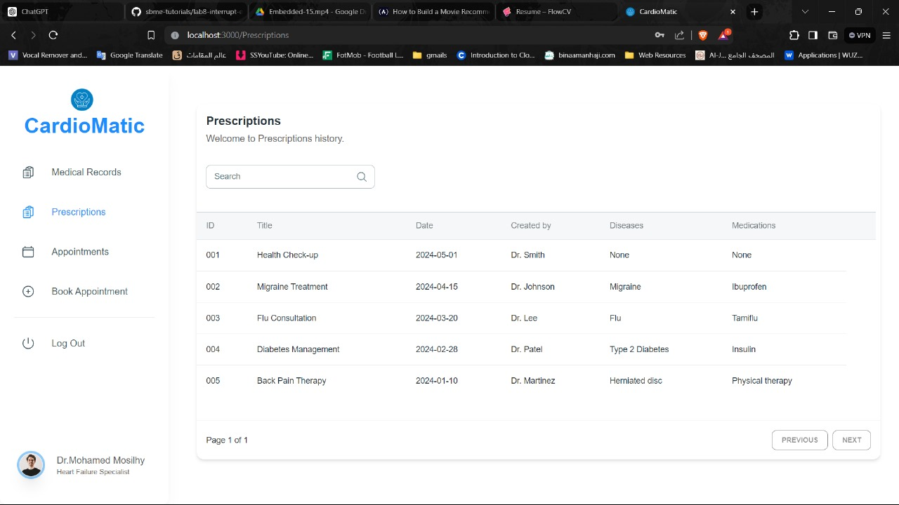
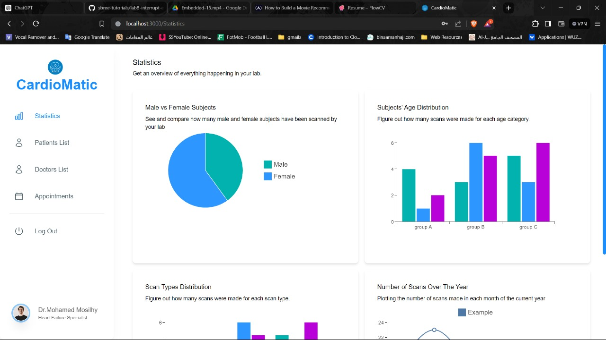

## CardioMatic Clinic

### Technologies
- **Backend:** Node.js with TypeScript
- **Frontend:** React
- **Database:** PostgreSQL

### ScreenShots
- 
- 
- 
- 

### Naming Conventions
- Use `camelCase` for variables and functions: `patientRecord`, `calculateBMI()`
- Use `PascalCase` for class names: `CardiovascularSystem`
- Use `UPPER_CASE` for constants: `MAX_HEART_RATE`

### Code Structure
- Keep line length to a maximum of 80 characters.
- Group related code blocks together and separate them with blank lines for readability.
- Use descriptive variable and function names to make the code self-explanatory.

### Error Handling
- Use try-except blocks to handle exceptions and provide meaningful error messages.

### Team Structure
- **Frontend Developers:** Mohamad Sayed Mosilhe & Sondos Mohamad.

### Team Members Contacts
- mohammed.abdulghani02@eng-st.cu.edu.eg
- sondos.mohamed02@eng-st.cu.edu.eg
- Mohamed.Al-Baydaq02@eng-st.cu.edu.eg
